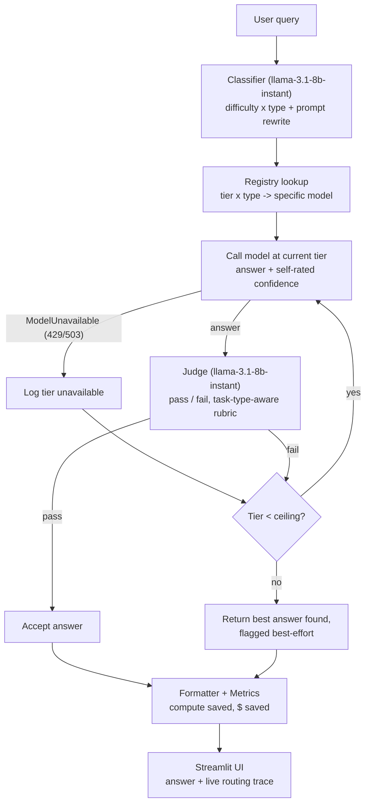

# LadderLLM

**Adaptive multi-tier LLM cascade router.** Every query starts at the cheapest model that
could plausibly answer it, and only escalates to a bigger one when a judge model confirms the
cheap answer actually failed. Runs entirely on free-tier APIs (Groq + OpenRouter) — no GPU, no
paid credits.

[](https://github.com/Mithun095/ladder-llm/actions/workflows/checks.yml)

## Why

Every LLM query today gets routed to one model chosen upfront — usually the largest one "just
in case." A question like "what is a closure in Python?" doesn't need a 550B-parameter
reasoning model. LadderLLM classifies each query by difficulty and task type, starts at the
smallest tier that could plausibly handle it, and escalates only when a judge model says the
cheap answer genuinely isn't good enough.

## Demo

**A coding query, resolved at tier 1 (cheapest tier), 87% compute saved vs. always using the biggest model:**


**A general-knowledge query, also resolved at tier 1, judge-approved:**


**A real bug, caught live while testing, not by any automated check** — a translation request
came back as a Google Maps disclaimer instead of a translation. Root-caused to the
classifier's prompt-rewrite step silently deleting the word "translate." Full debugging story
in [`BUILD-LOG.md`](BUILD-LOG.md):


## Architecture



Escalation ceiling depends on classified difficulty — easy/medium start at tier 1 (ceiling
tier 2), hard starts at tier 2 (ceiling tier 3), expert starts at tier 3 (ceiling tier 4).
Self-reported confidence alone turned out to be unreliable in testing (see below), so the
judge currently fires on every call rather than only on borderline confidence scores.

## Model grid

All 20 model IDs verified live against Groq's and OpenRouter's model-list endpoints before
being hardcoded (`checks/discover_models.py`). Active params = active parameters per token,
not total — matters for MoE models like `gpt-oss-120b` (~117B total, ~5.1B active).

| Tier | QA | Coding | Reasoning | Summarization | Translation |
|---|---|---|---|---|---|
| **1 — Nano** | Groq `llama-3.1-8b-instant` (8B) | OR `cohere/north-mini-code:free` (~7B) | Groq `llama-3.1-8b-instant` (8B) | Groq `llama-3.1-8b-instant` (8B) | Groq `llama-3.1-8b-instant` (8B) |
| **2 — Small** | Groq `qwen/qwen3.6-27b` (27B) | OR `poolside/laguna-xs-2.1:free` (~7B) | Groq `qwen/qwen3.6-27b` (27B) | Groq `llama-3.3-70b-versatile` (70B) | OR `google/gemma-4-26b-a4b-it:free` (4B active) |
| **3 — Large** | Groq `gpt-oss-120b` (5.1B active) | OR `poolside/laguna-m.1:free` (~32B) | OR `nemotron-3-super-120b-a12b:free` (12B active) | Groq `gpt-oss-120b` (5.1B active) | Groq `gpt-oss-120b` (5.1B active) |
| **4 — Max** | OR `nemotron-3-ultra-550b-a55b:free` (55B active) | same | same | same | same |

*(OR = OpenRouter, all `:free`)*

## Results

From the eval harness (`eval/run_eval.py`) — 25 queries across all 5 task types, cascade vs.
an always-tier-4 baseline (raw query, no classification, no escalation):

| Metric | Value |
|---|---|
| Cascade pass rate | 68% (parity with the always-max-tier baseline) |
| Avg. compute saved vs. always-tier-4 | 63.9% |
| Confidence calibration (ECE) | 0.405 — 0 is perfectly calibrated |

The calibration number is the interesting one: in the 0.8–1.0 self-reported confidence bucket
(i.e., "I'm 8-10/10 sure"), the actual judge-verified accuracy was only ~61%. Small models are
reliably overconfident — which is why the judge fires on every answer rather than trusting
confidence alone. See `eval/results_baseline_before_fixes.json` for the raw run and
`BUILD-LOG.md` for what that number changed after fixing a judge rubric mismatch and a
classifier prompt bug. *(A fully clean post-fix run is pending — OpenRouter's free-tier daily
quota was exhausted during testing; see Limitations.)*

## Tech stack

Python 3.11+, `groq` SDK, `openai` SDK (OpenRouter is OpenAI-compatible), `pydantic` v2 for
structured-output validation, `streamlit` for the UI, `python-dotenv` for config.

## Project structure

```
src/
  llm_client.py   provider abstraction (Groq/OpenRouter) + JSON-retry helper
  registry.py     tier x type -> model, plain dict, no class hierarchy
  classifier.py   difficulty x type tagging + prompt optimization
  judge.py        binary pass/fail answer evaluation, task-type-aware rubric
  cascade.py      the waterfall escalation loop
  metrics.py      compute-saved % and illustrative $-saved
  formatter.py    per-task-type answer formatting
  app.py          Streamlit UI
checks/           one assert-based self-check per module, no pytest
eval/             25-query benchmark harness + calibration (ECE) analysis
```

## Running it

```bash
python3 -m venv .venv && source .venv/bin/activate
pip install -r requirements.txt
cp .env.example .env   # add your free Groq + OpenRouter API keys
PYTHONPATH=. streamlit run src/app.py
```

Run the self-checks: `PYTHONPATH=. python -m checks.check_<name>`
Run the eval harness: `PYTHONPATH=. python -m eval.run_eval`

## Limitations

- **OpenRouter's free tier caps unpaid accounts at 50 requests/day, account-wide** (1000/day
  with a one-time $10 credit). A day of active testing will exhaust it. The system degrades
  correctly when this happens (tiers get marked unavailable, cascade escalates or returns a
  best-effort answer) — verified under this exact condition, not just simulated.
- The judge is a small model (`llama-3.1-8b-instant`) and, per its own documented scope, is
  used as a binary pass/fail filter, not a nuanced scorer — it still occasionally nitpicks
  valid answers on subjective tasks (summarization, translation) even with task-aware guidance.
- Dollar-cost savings are illustrative (a documented approximate rate, not real per-model
  billing) since these are free models with no actual per-token bill.
- Translation quality at tier 1 is weakest on less common language pairs — the underlying
  model handles common pairs (EN↔ES/FR/DE) better than less common ones.

## Process

This was built with a full design spec → implementation plan → task-by-task build cycle, with
every real bug, debugging step, and design decision logged as it happened:
- [`BUILD-LOG.md`](BUILD-LOG.md) — every real error hit and how it was diagnosed and fixed
- [`DEVLOG.md`](DEVLOG.md) — what was built, in order, and why
- [`INTERVIEW-PREP.md`](INTERVIEW-PREP.md) — project walkthrough + anticipated interview Q&A
