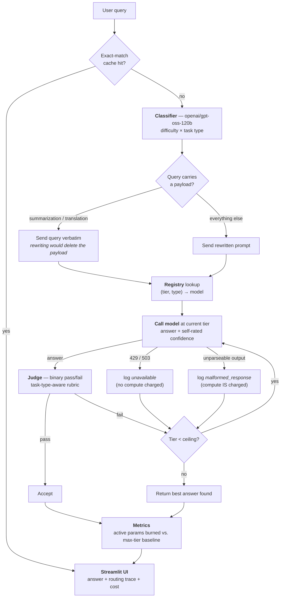

# LadderLLM

**An adaptive multi-tier LLM cascade router.** Every query starts at the cheapest model that
could plausibly answer it, and escalates to a bigger one only when a judge model confirms the
cheap answer actually failed. Runs entirely on free-tier APIs — no GPU, no paid credits.

[](https://github.com/Mithun095/ladder-llm/actions/workflows/checks.yml)

---

## Why

Almost every LLM application picks one model up front and sends everything to it — usually the
biggest one, because that's the safe default. Most queries don't need it. *"What is the capital
of Australia?"* is answered correctly by an 8B model in under a second; routing it to a 550B
model burns roughly 7× the compute for the same answer.

A **cascade router** starts each query at the cheapest model that could plausibly handle it,
checks whether the answer is actually good, and escalates only when it isn't — so you pay
big-model prices only for the queries that genuinely need a big model. That's the idea behind
[FrugalGPT](https://arxiv.org/abs/2305.05176) and [RouteLLM](https://arxiv.org/abs/2406.18665).
LadderLLM implements it on entirely free infrastructure, and ships an eval harness so the
savings claim is **measured rather than asserted**.

## How it works



**Two axes, not one.** Task *type* decides which model is good at the work — a model good at
code is not automatically good at translation. *Difficulty* decides how far up the ladder to
start, and how far it's allowed to climb:

| difficulty | starts at | ceiling |
|---|---|---|
| easy / medium | tier 1 | tier 2 |
| hard | tier 2 | tier 3 |
| expert | tier 2 | tier 4 |

Hard and expert both *enter* at tier 2; what difficulty controls is how far they may **climb**.
Expert used to enter at tier 3, which was right when tier 3 held the biggest model — after the
tier 2/3 swap it meant expert queries skipped a 117B model to open on a 27B one costing 11×
more. `checks/check_registry.py` now fails if any difficulty starts at a tier that a skipped
tier beats on **both** price and size ([`BUILD-LOG.md` #22](BUILD-LOG.md#22-the-tier-swap-left-a-second-dict-pointing-at-the-old-ladder)).

**A tier's outcome is never collapsed into "worked" or "failed".** Conflating these produces
wrong answers *and* wrong metrics — a provider outage must never be read as a bad answer:

| trace status | meaning | compute charged? |
|---|---|---|
| `accepted` | judge looked at it and passed it | yes |
| `accepted_unverified` | model answered, judge was down or unparseable → show it, don't score it | yes |
| `judged_fail` | model answered, judge rejected it → escalate | yes |
| `malformed_response` | model ran, output wouldn't parse → escalate | **yes** — tokens were burned |
| `unavailable` | provider returned 429/503, model never ran → skip tier | **no** |

**Confidence is collected but not trusted.** The original design fast-accepted on self-reported
confidence ≥8 and only paid for a judge in the ambiguous 5-7 band. Measurement killed it:
confidence came back 9-10 on *every* call, on correct and wrong answers alike, so the ambiguous
band was never reached and the judge never fired. The judge now runs on every answer, and
confidence survives only as the input to the calibration metric. The original code is still
there behind a flag — [`DEVLOG.md`](DEVLOG.md) explains why.

## Model grid

All 20 entries are validated against both providers' **live** catalogs by
`checks/check_model_ids.py` — which earned its keep by catching a model that got delisted
mid-project. Sizes below are *active* parameters per token, not total — for the sparse
Mixture-of-Experts models in the grid those are very different numbers, which is the whole
subject of the next section.

| Tier | QA | Coding | Reasoning | Summarization | Translation |
|---|---|---|---|---|---|
| **1 — Nano** | Groq `llama-3.1-8b-instant` (8B) | Groq `openai/gpt-oss-20b` (3.6B active) | Groq `llama-3.1-8b-instant` (8B) | Groq `llama-3.1-8b-instant` (8B) | Groq `llama-3.1-8b-instant` (8B) |
| **2 — Small** | Groq `openai/gpt-oss-120b` (5.1B active) | Groq `openai/gpt-oss-120b` (5.1B active) | Groq `openai/gpt-oss-120b` (5.1B active) | Groq `openai/gpt-oss-120b` (5.1B active) | Groq `openai/gpt-oss-120b` (5.1B active) |
| **3 — Large** | Groq `qwen/qwen3.6-27b` (27B) | OR `poolside/laguna-s-2.1:free` (~14B) | OR `nvidia/nemotron-3-super-120b-a12b:free` (12B active) | Groq `qwen/qwen3.6-27b` (27B) | OR `google/gemma-4-26b-a4b-it:free` (4B active) |
| **4 — Max** | OR `nvidia/nemotron-3-ultra-550b-a55b:free` (55B active) | same | same | same | same |

*(OR = OpenRouter, all `:free`)*

### Why tier 2 is the 120B model

Because it is the cheapest model in the ladder. That sounds backwards, so here are the published
per-token rates for the paid listings of the same open-weight models:

| tier | model | active params | $/1M in | $/1M out |
|---|---|---|---|---|
| 1 | `llama-3.1-8b-instant` | 8B | 0.050 | 0.080 |
| 2 | `openai/gpt-oss-120b` | **5.1B** | **0.037** | **0.170** |
| 3 | `qwen/qwen3.6-27b` | 27B | 0.300 | 2.000 |
| 4 | `nvidia/nemotron-3-ultra-550b-a55b:free` | 55B | 0.500 | 2.200 |

`gpt-oss-120b` is a sparse Mixture-of-Experts model: ~117B total parameters, but only ~5.1B are
activated per token. `qwen3.6-27b` is dense — all 27B fire on every token. So the 120B model is
about **12× cheaper per output token than the 27B model**, and "bigger model" stops meaning
"more expensive model" the moment MoE enters the ladder.

Tiers 2 and 3 were originally the other way round, ordered by total parameter count. That made
the cascade escalate *down* the price curve, and — because `CEILING_TIER` stops easy and medium
queries at tier 2 — left it structurally unable to reach a model that was both better and
cheaper. `checks/check_registry.py` now asserts price monotonicity so it can't silently invert
again. Full write-up: [BUILD-LOG #20](BUILD-LOG.md#20-the-cascade-was-escalating-down-the-price-curve).

**The two cost metrics genuinely disagree, and the app reports both.** Active params say tier 1
(8B) costs more than tier 2 (5.1B); published price says the opposite. Neither is wrong — active
params measure compute, price measures what the market charges for it, and sparse models are
exactly where the two come apart. The ladder is ordered by price.

## Demo

**A coding query resolved at tier 1 — the cheapest model handled it:**

*(Screenshot predates the coding-tier move to Groq; the caption used to quote 87% compute saved, which was the figure for the 7B model that used to sit at tier 1. Tier-1 coding is now 3.6B active, i.e. ~93%.)*


**A general-knowledge query, also resolved at tier 1 and judge-approved:**


Escalation is the interesting case. *"A farmer has 17 sheep. All but 9 die. How many are left?"*
is a trick question the 8B tier-1 model often gets wrong. Here is what it actually does, across
three consecutive runs of the **same query** — verbatim, not cherry-picked:

```
run 1   tier 1  llama-3.1-8b-instant  → malformed_response
        tier 2  qwen/qwen3.6-27b      → accepted   (confidence 10)
                judge: "Correct number of sheep left after 9 die."     answer: 9

run 2   tier 1  llama-3.1-8b-instant  → accepted   (confidence 10)     answer: 9

run 3   tier 1  llama-3.1-8b-instant  → judged_fail (confidence 10)
                judge: "The proposed answer is incorrect; 17 - 9 = 8."
        tier 2  qwen/qwen3.6-27b      → judged_fail (confidence 10)
                judge: "The proposed answer contradicts the own answer."
```

*(Recorded before the tier 2/3 swap described above, which is why tier 2 here is
`qwen3.6-27b` — today that model sits at tier 3. Left verbatim rather than re-run and
tidied, because these are observed traces and run 3 is the point.)*

Run 1 is the system working as designed: tier 1 fails, tier 2 answers correctly, escalation
stops. Run 2 shows tier 1 getting it right on its own. **Run 3 is the honest failure**, and it's
the most informative of the three: the judge solved the riddle *itself*, got 8 — falling for the
same trick — and therefore rejected the correct answer 9, twice.

That is the ceiling of this design stated plainly. A judge is only as good as its own ability to
answer the question, so on problems that fool small models it fools the referee too. It's also
why the judge is measured separately against known-correct labels rather than trusted — see
[Results](#results). Note tier 1's confidence in run 3: **10, on a wrong answer.** That's the
calibration problem, and the reason self-reported confidence isn't used for routing.

### Prompts to try

Each of these exercises a different path. All were verified end to end; the routing decision is
made per-run by a model, so tiers can vary by one between runs.

| Prompt | Exercises | Expected |
|---|---|---|
| `What is the capital of Australia?` | cheapest path | tier 1, accepted, ~85% saved, <1s |
| `A farmer has 17 sheep. All but 9 die. How many sheep are left?` | **escalation** — run it 2-3 times | usually tier 1 fails → tier 2 answers `9`; sometimes tier 1 gets it, sometimes the judge itself falls for the trick (see above) |
| `What is 17 * 23?` | reasoning | accepted, answer `391` |
| `Summarize: The stock market saw significant volatility this week as investors reacted to new inflation data, with tech stocks leading the decline before a late recovery on Friday.` | **payload preservation** | summarizes *that text* — not general stock-market commentary |
| `Translate 'Where is the nearest train station?' to Spanish` | payload preservation | `¿Dónde está la estación de tren más cercana?` — translated, not answered |
| *(submit any of the above twice)* | **cache** | second run: green cache banner, 0 model calls, 0.0s |
| `Write a Python function that checks if a string is a palindrome` | coding | answers at tier 1 or 2 on Groq. Coding used to run on OpenRouter at every tier, so it died completely whenever the daily cap was gone — [`BUILD-LOG.md` #24](BUILD-LOG.md#24-a-whole-task-type-with-no-fallback-and-a-benchmark-that-measured-the-wrong-thing) |

The two payload-preservation prompts are the ones worth understanding: both used to fail — the
summarizer would talk about the stock market from memory, and the translator would try to
*answer* "where is the nearest train station?" — because the classifier's prompt-rewrite step
was paraphrasing away the text it was given ([`BUILD-LOG.md` #13](BUILD-LOG.md#13-the-classifier-was-deleting-the-text-it-was-asked-to-summarize)).

When no tier's answer passes the judge, the UI says so explicitly and labels the output
**"Best attempt (rejected)"** with the judge's reason, rather than presenting a rejected answer
as if it were verified.

## Results

From `eval/run_eval.py` — 25 queries across all five task types, each run through the full
cascade **and** through an always-tier-4 baseline: the raw query straight to the biggest model,
no prompt rewrite, no escalation. Both arms are graded by the same task-type-aware judge rubric,
so the comparison is about routing and not about grading.

> **These numbers were measured before three later changes** — the expert entry-tier fix
> ([#22](BUILD-LOG.md#22-the-tier-swap-left-a-second-dict-pointing-at-the-old-ladder)),
> the classifier swap to `gpt-oss-120b`
> ([#23](BUILD-LOG.md#23-the-cheapest-model-in-the-system-was-making-the-most-expensive-mistake)),
> and moving the coding tiers to Groq
> ([#24](BUILD-LOG.md#24-a-whole-task-type-with-no-fallback-and-a-benchmark-that-measured-the-wrong-thing)).
> All three change routing, so tier distribution and both savings figures will move. They are **not** re-measured here because a sweep run today
> would report every OpenRouter tier as `unavailable` — the free daily quota is exhausted — and
> that degradation has nothing to do with the changes. Re-run `python -m eval.run_eval` after the
> 00:00 UTC reset for a clean number. Saying which config a number belongs to is cheaper than
> discovering later that it belonged to none of them.

| Metric | Value | Judge-dependent? |
|---|---|---|
| Avg. **cost** saved vs. always-tier-4 (published $/token rates) | **92.7%** | partly — see below |
| Avg. **compute** saved vs. always-tier-4 (active params) | **83.7%** | partly — see below |
| Where queries resolved (all 25) | **14 at tier 1**, 10 at tier 2, 1 at tier 3 | barely |
| Cascade pass rate | **88%** (22/25) | **yes** |
| Confidence calibration (ECE) | 0.279 — 0 is perfect calibration | **yes** |

**A correction to what this README used to claim.** It said the two savings figures "depend only
on which tiers ran, not on the judge's opinion of anything." That is true of each *per-query*
value and false of the *average*, because the average is taken over the runs the judge accepted
(`eval/run_eval.py` accumulates them under `if cascade_ok`). The judge picks the population, so
the mean inherits the judge's instability — and
[`BUILD-LOG.md` #19](BUILD-LOG.md#19-the-same-bug-a-third-time-36-compute-saved-on-an-answer-that-was-rejected)
records that introducing exactly this gate *moved the number*, because rejected runs are the ones that
escalate furthest and cost most. Both savings figures are less noisy than the pass rate, since
each individual value is judge-free; neither is immune.

**22 of 25 queries were answered acceptably, 14 of them by the cheapest model on the ladder.**
The tier row above covers all 25 runs, including the 3 that failed — one of which climbed to
tier 3 before being rejected. An earlier version of this table showed `14 / 8 / 0`, which was the
accepted-only subset: it summed to 22 inside a table about 25, and erased the failures from the
record of where the cascade actually spent money. Where a query *ran* and whether it *passed* are
different questions, and a table that answers one while looking like it answers both is the same
population-mixing this project keeps having to correct.

Per task type, from the same run:

| Type | Pass |
|---|---|
| QA | **5/5** |
| Reasoning | **5/5** |
| Summarization | **5/5** (was **1/5** before the prompt-payload fix — [`BUILD-LOG.md` #13](BUILD-LOG.md#13-the-classifier-was-deleting-the-text-it-was-asked-to-summarize)) |
| Translation | 4/5 |
| Coding | 3/5 |

*(Per-type totals shift between runs because the classifier assigns the type, and it isn't
deterministic — a query counted under QA in one sweep can land under reasoning in the next.)*

### The pass rate is dominated by noise

Two **identical** sweeps — same code, same queries, same config — scored **72% and 84%**. Five
of 25 queries flipped verdict, and the classifier relabelled some queries' difficulty in
between. So this benchmark cannot resolve any difference smaller than about 12 points, and the
88% above is one draw from a wide distribution, not an improvement over the 72% this README used
to quote. I found this by running an A/B test that returned a suspiciously perfect result and
re-running the *control* instead of believing it ([`BUILD-LOG.md` #21](BUILD-LOG.md#21-two-identical-benchmark-runs-scored-72-and-84)).

The savings figures are steadier, because no verdict appears anywhere in a per-query value —
it is which tiers ran, priced at published per-token rates. They are not immune, though: the
reported number is a mean over judge-accepted runs, so the judge still chooses the population.
See the correction above.

### Versus the always-max-tier baseline

On the 16 queries where the tier-4 model was reachable, compared head to head on the same
queries:

| | Pass |
|---|---|
| Cascade | **14/16** (87.5%) |
| Always-tier-4 baseline | 10/16 (62.5%) |

The cascade won 5 of the 6 queries where the two disagreed. **That is suggestive, not proven** —
a two-sided sign test on 6 discordant pairs gives *p* ≈ 0.22, so it does not clear significance
at n=16. The honest claim is that the cascade was *not worse* than always using the largest
model, while using a fraction of the compute; "better" needs a bigger benchmark than this one.

Reproduce it from `eval/results.json`:

```python
ran = [r for r in results["per_query"] if r["baseline_ran"]]
sum(r["cascade_passed"] for r in ran), sum(r["baseline_passed"] for r in ran), len(ran)
# -> (14, 10, 16)
```

`baseline_ran` is recorded per query because `baseline_passed: false` on its own conflates *"the
tier-4 model ran and got it wrong"* with *"the tier-4 model was never reachable"* — and scoring
a provider outage as a baseline failure would hand the cascade a win it didn't earn.

### Every number above is scored by the judge — so the judge is measured separately

This is the most important caveat in the project, and it's why there's a second harness.

Pass rate and ECE are computed directly from **judge verdicts**; the two savings averages are
selected by them. The judge is also a component I tune. So when a change to the judge's prompt
made every one of those numbers improve
at once, the benchmark could not tell me whether the router got better or the grading just got
easier — it is structurally incapable of distinguishing those.

So `eval/judge_ground_truth.py` holds 14 hand-labelled `(question, answer, should_pass)` cases
with known-correct verdicts, and `checks/check_judge_accuracy.py` measures the judge's two error
types separately, because they are not equally bad:

| | what it means | measured |
|---|---|---|
| **False pass** | accepts a wrong answer — the user gets something incorrect | **29%** |
| **False fail** | rejects a correct answer — wastes compute escalating | **29%** |

A 29% false-pass rate is bad, and stating it is the point. It was **57%** before: shown
`17 * 23 = 371`, the judge replied *"the answer to the multiplication of 17 and 23 is correctly
stated as 371."* It wasn't verifying, it was ratifying whatever it was shown and inventing
justification afterwards. The fix was to make it commit to its own answer *before* it's allowed
to render a verdict ([`BUILD-LOG.md` #18](BUILD-LOG.md#18-the-judge-wasnt-judging--it-was-agreeing-and-my-benchmark-couldnt-tell)); that halved the harmful error rate at
no cost to the wasteful one.

**What this means for the headline numbers:** treat the pass rate as "the share of answers this
judge approved," with a judge known to wrongly approve about 29% of wrong answers — and with a
run-to-run spread of about 12 points on top of that. Two independent sources of error stack on
the same number. The savings figures carry only the second-hand version of this — see the
correction above.

**Read `eval/results.json` with the caveats it records.** The savings average covers accepted
runs only, which is what excludes a query where every tier was rate-limited: it burns zero
compute and would otherwise score a meaningless "100% saved", and a rejected run that escalated
twice would charge the average with the price of failure. Per-query `compute_saved_pct` is
`null` on those rows rather than 0, so the two cases stay distinguishable in the file. The
baseline arm reports `n/a` rather than 0% when the tier-4 model was unreachable, because scoring
an outage as a baseline failure would credit the cascade for a provider problem. Since tier 4 is
OpenRouter for every task type, the head-to-head baseline comparison needs free-tier quota
headroom — see [Limitations](#limitations).

## Running it

```bash
python3 -m venv .venv && source .venv/bin/activate
pip install -r requirements.txt
cp .env.example .env          # add your free Groq + OpenRouter API keys
PYTHONPATH=. streamlit run src/app.py
```

`PYTHONPATH=.` is required: `streamlit run src/app.py` launches the file directly, which puts
only `src/` on the import path, so `from src.cascade import ...` can't resolve.

```bash
PYTHONPATH=. python -m checks.check_cascade      # any single check
PYTHONPATH=. python -m eval.run_eval             # full benchmark sweep
PYTHONPATH=. python -m checks.check_model_ids    # verify the registry against live catalogs
```

## Project structure

```
src/
  llm_client.py   provider abstraction (Groq/OpenRouter), JSON extraction, retry, rate limits
  registry.py     (tier, type) -> model, a plain dict
  classifier.py   difficulty x type tagging + prompt optimization
  judge.py        binary pass/fail evaluation with a task-type-aware rubric
  cascade.py      the escalation loop, trace recording, and query cache
  metrics.py      compute saved (unclamped) and an illustrative $ figure
  formatter.py    per-task-type answer presentation
  app.py          Streamlit UI
checks/           one assert-based script per concern; 5 of 13 run in CI without API keys
eval/             25-query benchmark harness, calibration (ECE), judge ground truth, and
                  compare_coding_models.py — which scores coding models by *running* their output
```

No pytest — each check is a plain script you run with `python -m checks.check_x` that prints
what it saw and asserts on it. For a project this size a test framework is ceremony; what
matters is that everything has something that fails loudly when it breaks.

## Limitations

- **OpenRouter's free tier caps unpaid accounts at 50 requests/day, account-wide** (1000/day
  with a one-time $10 credit); Groq caps at 30 requests/minute. A day of active testing exhausts
  the former. The system degrades correctly — tiers get marked unavailable and the cascade
  escalates or returns a best-effort answer — verified under the real condition, not a simulated
  one. But it does mean the full cross-provider eval can only be run about once a day.
- **The judge is the weakest component, and it's quantified rather than hand-waved:** ~29%
  false-pass rate (approves a wrong answer) and ~29% false-fail rate (rejects a correct one),
  measured by `checks/check_judge_accuracy.py`. Every quality number in this repo inherits that
  uncertainty. For objective task types the right long-term fix isn't a better judge prompt,
  it's real ground truth — for coding, that means running the tests.
- **The benchmark is 25 self-authored queries.** It's a good bug-finding instrument (it found
  five real bugs in its first run) and a weak statistical claim.
- **Dollar savings are illustrative.** They use each model's published $/1M-token rate — a real
  external price, but for the *paid* listing of the same open-weight model, since everything
  called here is a free endpoint with no bill to reconcile against. One model — tier-3 coding's
  `poolside/laguna-s-2.1` — has no paid listing anywhere and falls back to an estimate from
  active params.
- **The cache is exact-match, in-process.** Paraphrases miss, and it's cleared on restart.

## How this was built

Every real bug, debugging step and design decision was logged as it happened — including the
ones where the first diagnosis was wrong:

- **[`BUILD-LOG.md`](BUILD-LOG.md)** — a debugging casebook. 25 issues, each as
  symptom → how I found the cause → root cause → fix → takeaway. Only about a third were bugs in
  code; the rest were bugs in a prompt, a metric, a test, a comment, or an assumption.
- **[`DEVLOG.md`](DEVLOG.md)** — what got built and why, module by module, with the concepts
  explained.
- **[`INTERVIEW-PREP.md`](INTERVIEW-PREP.md)** — project walkthrough, design rationale and a
  full anticipated Q&A.

The single most useful entry is
[`BUILD-LOG.md` #13](BUILD-LOG.md#13-the-classifier-was-deleting-the-text-it-was-asked-to-summarize),
where a documented "fix" turned out to be a wrong root cause that had produced a small
improvement — the most effective disguise a wrong diagnosis has.
